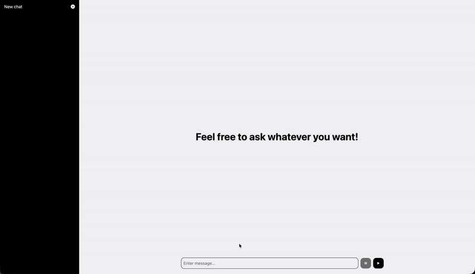

Simple-LLM is a lightweight interface for interacting with Large Language Models through a clean and minimal API.
It’s designed to be easy to integrate, easy to extend, and easy to run locally or in production.

Fill .env file with api key befor usage!
